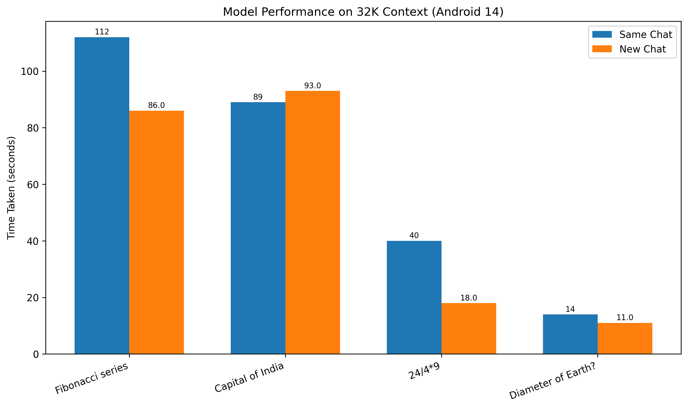

# 🤖 Local AI - Offline AI Assistant

A beautiful, fully offline AI chatbot app for Android that works completely without internet connection using **llama.cpp** and your **local GGUF model**.

## ✨ Features

- **🔒 100% Offline**: No internet required, complete privacy protection
- **🎨 Beautiful UI**: Gradient backgrounds with modern Material Design 3
- **🌙 Dark/Light Theme**: Toggle between themes with smooth animations
- **💬 Chat Interface**: GROK AI-inspired chat bubbles and interactions
- **🚀 Native Performance**: C++ integration with llama.cpp for fast inference
- **📱 Android Native**: Built with Jetpack Compose for smooth performance
- **✅ 32,000 Context Limit**

## 🚀 Results 32k Context Limit
```
32K CONTEXT LIMIT | 128 BATCH SIZE
----------------------------------
PROMPT 1: FIBONACCI SERIES
TIME TAKEN : 1 MIN 26 SEC
OUTPUT LENGTH : HIGH

PROMPT 2: CAPITAL OF INDIA
TIME TAKEN: 1 MIN 29 SEC
ON NEW CHAT : 1 MIN 33 SEC
OUTPUT LENGTH : HIGH

PROMPT 3: 24/4*9
TIME TAKEN: 40 SEC
ON NEW CHAT : 18 SEC
OUTPUT LENGTH : HIGH

PROMPT 4: DIAMETER OF EARTH?
TIME TAKEN: 14 SEC
ON NEW CHAT: 11 SEC
OUTPUT LENGTH : SMALL 
```
#### Response Time 32K Context Limit



## 🛠️ Complete Build Instructions for Android Studio

### Prerequisites

Before building this project, ensure you have the following installed:

1. **Android Studio**: Hedgehog (2023.1.1) or later
2. **Android SDK**: API Level 24 (minimum) to API Level 36 (target)
3. **Android NDK**: Version 27.0.12077973 or compatible
4. **CMake**: Version 3.22.1 (will be installed automatically by Android Studio)
5. **Git**: For cloning the repository

### Step-by-Step Build Instructions

#### Step 1: Clone and Open Project

1. **Clone the repository** (if not already done):
   ```bash
   git clone https://github.com/satwikshirsat04/Offline-AI-Chatbot.git
   ```

2. **Open Android Studio**
3. **Select "Open an Existing Project"**

#### Step 2: Install Required SDK Components

1. **Open SDK Manager**: `Tools` → `SDK Manager`
2. **In SDK Platforms tab**, ensure you have:
   - Android 14.0 (API 34) - recommended
   - Android 7.0 (API 24) - minimum required
3. **In SDK Tools tab**, ensure you have:
   - ✅ Android SDK Build-Tools (latest)
   - ✅ Android SDK Command-line Tools
   - ✅ Android SDK Platform-Tools
   - ✅ Android Emulator
   - ✅ NDK (Side by side) - Version 27.0.12077973
   - ✅ CMake - Version 3.22.1
4. **Click "Apply"** to install missing components

#### Step 3: Configure NDK Path (If Needed)

1. **Go to**: `File` → `Project Structure` → `SDK Location`
2. **Verify NDK location** is set to: `<SDK_PATH>/ndk/27.0.12077973`
3. **If not set**, browse and select the correct NDK path
4. **Click "OK"**

#### Step 4: Sync Project

1. **Click "Sync Now"** when prompted, or go to `File` → `Sync Project with Gradle Files`
2. **Wait for sync to complete** (this may take a few minutes on first run)
3. **Resolve any dependency issues** if prompted

#### Step 5: Add Required Libraries and Model Files

##### 5.1: Add JNI Libraries
1. **Download JNI Libraries**: Get the required `.so` files from Google Drive:
   - Link: [https://drive.google.com/drive/folders/1yMsgDC7I3CWS9ZPXFCQrthL40Rq18ZLF?usp=sharing](https://drive.google.com/drive/folders/1yMsgDC7I3CWS9ZPXFCQrthL40Rq18ZLF?usp=sharing)

2. **Create JNI Libraries Directory**:
   ```
   app/src/main/jniLibs/arm64-v8a/
   ```

3. **Copy Libraries**: Download and paste all `.so` files from the Google Drive link into the `jniLibs/arm64-v8a/` directory:
   - `libllama.so`
   - `libggml.so`
   - `libggml-base.so`
   - `libggml-cpu.so`
   - `libmtmd.so`
   - `libomp.so`

##### 5.2: Add Model File
1. **Create Assets Directory**:
   ```
   app/src/main/assets/
   ```
2. **Download Model from Huggingface**

- link: https://huggingface.co/unsloth/LFM2-1.2B-GGUF/blob/main/LFM2-1.2B-Q4_0.gguf

2. **Add Model**: Place your GGUF model file in the assets directory:
   ```
   app/src/main/assets/LFM2-1.2B-Q4_0.gguf
   ```

##### 5.3: Verify Configuration
1. **Check** `app/build.gradle.kts` contains:
   ```kotlin
   ndk {
       abiFilters += listOf("arm64-v8a")
   }
   ```

2. **Verify Directory Structure**:
   ```
   app/src/main/
   ├── assets/
   │   └── LFM2-1.2B-Q4_0.gguf
   └── jniLibs/
       └── arm64-v8a/
           ├── libllama.so
           ├── libggml.so
           ├── libggml-base.so
           ├── libggml-cpu.so
           └── libmtmd.so
           └── libomp.so
   ```

#### Step 6: Build the Project

1. **Clean the project**: `Build` → `Clean Project`
2. **Rebuild the project**: `Build` → `Rebuild Project`
3. **Wait for build to complete** (first build may take 5-10 minutes)

#### Step 7: Set Up AI Model

**IMPORTANT**: You need to provide your own GGUF model file. The app expects a model named `LFM2-1.2B-Q4_0.gguf`.

**Option 1: Assets Folder (Recommended for Development)**
```
/app/src/main/assets/LFM2-1.2B-Q4_0.gguf
```
- Create the `assets` folder: `app/src/main/assets/`
- Copy your GGUF model file into this folder
- Rebuild the project to include the model in the APK


#### Step 8: Run the App

1. **Connect an Android device** (API 24+) or **start an emulator**
2. **Enable USB Debugging** on your device (if using physical device)
3. **Select your device** from the device dropdown
4. **Click the "Run" button** (green play icon) or press `Shift + F10`
5. **Wait for installation and launch**

### Troubleshooting Common Issues

#### Build Errors

**Error: "unable to find library -lllama"**
- **Solution**: Ensure `libllama.so` exists in `app/src/main/jniLibs/arm64-v8a/`
- **Check**: CMakeLists.txt points to correct library path

**Error: "NDK not configured"**
- **Solution**: Install NDK through SDK Manager
- **Set**: NDK path in Project Structure settings

**Error: "CMake not found"**
- **Solution**: Install CMake 3.22.1 through SDK Manager
- **Verify**: CMake path in SDK Tools

#### Runtime Errors

**App crashes on startup**
- **Check**: Model file is present and accessible
- **Verify**: Device has sufficient RAM (2GB+ recommended)
- **Review**: Logcat for specific error messages

**Model not loading**
- **Ensure**: Model file is in correct location
- **Check**: File permissions and storage space
- **Verify**: Model file is not corrupted

### Build Configuration Details

- **Target Architecture**: arm64-v8a only
- **Minimum SDK**: API 24 (Android 7.0)
- **Target SDK**: API 36 (Android 14)
- **NDK Version**: 27.0.12077973
- **CMake Version**: 3.22.1
- **Kotlin Version**: Latest stable
- **Compose BOM**: Latest stable

### Performance Optimization

- **Release Build**: Use `Build` → `Generate Signed Bundle/APK` for optimized release builds
- **ProGuard**: Enabled for release builds to reduce APK size
- **Native Optimization**: C++ code compiled with `-O2` optimization for release builds

## 🎯 App Components

### Native C++ Layer
- **CMakeLists.txt**: Build configuration for native libraries
- **native-lib.cpp**: JNI interface for Kotlin-C++ communication
- **llama_wrapper.cpp/h**: Simplified llama.cpp integration wrapper

### Android/Kotlin Layer
- **LlamaService.kt**: Service class for AI model management
- **ChatViewModel.kt**: MVVM pattern for chat state management
- **UI Components**: Beautiful gradient backgrounds, chat bubbles, input fields

### UI Features
- **Gradient Background**: Multi-color gradients for both light and dark themes
- **Chat Bubbles**: User messages (right-aligned, blue) and AI responses (left-aligned with avatar)
- **Top Banner**: App name with theme toggle button
- **Message Input**: Rounded input field with send button
- **Typing Indicator**: Animated dots while AI is processing

## 🎨 Design Highlights

- **Color Scheme**: Modern indigo/cyan gradient with carefully chosen accent colors
- **Typography**: Clean, readable fonts with proper spacing
- **Animations**: Smooth transitions and typing indicators
- **Accessibility**: High contrast ratios and proper touch targets

## 🔧 Technical Architecture

```
┌─────────────────────────────────────┐
│           UI Layer (Compose)        │
│  ┌─────────────┐ ┌─────────────────┐│
│  │ ChatScreen  │ │  UI Components  ││
│  └─────────────┘ └─────────────────┘│
└─────────────────┬───────────────────┘
                  │
┌─────────────────▼───────────────────┐
│        ViewModel & Service          │
│  ┌─────────────┐ ┌─────────────────┐│
│  │ChatViewModel│ │  LlamaService   ││
│  └─────────────┘ └─────────────────┘│
└─────────────────┬───────────────────┘
                  │ JNI
┌─────────────────▼───────────────────┐
│           Native C++ Layer          │
│  ┌─────────────┐ ┌─────────────────┐│
│  │ native-lib  │ │ llama_wrapper   ││
│  └─────────────┘ └─────────────────┘│
└─────────────────────────────────────┘
```

## 📝 Usage Instructions

1. **First Launch**: The app will initialize the AI model (may take a few seconds)
2. **Chat**: Type your message in the input field and tap send
3. **Theme Toggle**: Use the sun/moon icon in the top right to switch themes
4. **Privacy**: All conversations stay on your device - no data leaves your phone

## 🚀 Performance Notes

- Model loading happens once on app startup
- Responses are generated locally using your device's CPU
- Memory usage optimized for mobile devices
- Smooth 60fps UI animations

## 🛡️ Privacy & Security

- **Zero Network Requests**: App works completely offline
- **Local Processing**: All AI inference happens on your device
- **No Data Collection**: No analytics, tracking, or data sharing
- **Secure Storage**: Model and conversations stored locally

## Final Thoughts

- Higher n_ctx = more memory usage + slower inference.

- On PC with big GPU/CPU, you can allocate 32k.

- On mobile devices, setting 32k is crashing (not enough RAM) or be super slow.

- That’s why you set 4096 (safe default).

### ✈️ Performance on Android

- ✅ On **Satwik's Phone 4GB RAM**, the model runs **smoothly at 2048 tokens (n_ctx = 2048)** with reasonable response times.  
- ⚠️ At **4096 tokens (n_ctx = 4096)**, the model still works, but response generation takes **around 3 minutes**, making it impractical for real-time use.  
- ⏳ This shows that while the phone can technically handle larger contexts, **smaller context sizes (e.g., 2048)** are currently more optimal for balancing **speed, memory usage, and user experience**.


### ✅ Summary

- 32k is the max supported by the model.

- We can decide how much to use in ctx_params.n_ctx.

- Setting it lower (e.g., 4096 or 2048) = less memory + faster inference, but shorter context.

- Setting it higher (e.g., 8192, 16k, 32k) = longer memory window, but needs more RAM and compute.

### ⚡ For your Android app:

- Stick with 2048–4096 for smooth performance.

- 32k is theoretical max, but not practical for phones right now.

### 📊 Performance Analysis Results

Here are the detailed performance analysis results from our testing:

#### Average Response Time per Context Limit


#### Response Time per Query Context Limit


#### Response Time per Query Batch Size


### ⚡ Device-Specific Performance Guidelines

- High-end Android 12–14 (Snapdragon 8 Gen 2/3, 12–16 GB RAM) → can handle 32k ctx + batch 256.

- Mid-range Android 7–11 (3–8 GB RAM) → use 2048 ctx + batch 64/128 for fastest response.

- Bigger n_ctx = more memory, slower response. Bigger n_batch = faster but heavier.

## 🎯 Future Enhancements

- Model switching support
- Conversation history persistence
- Export chat functionality
- Custom themes and colors
- Voice input/output support

## 📄 License

This project is created for educational and personal use. Please ensure you have proper licensing for any AI models you use with this application.

---

**Made with ❤️ for the Indian AI community**

Enjoy your private, offline AI assistant! 🚀
